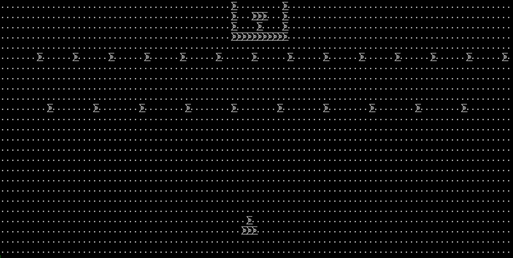
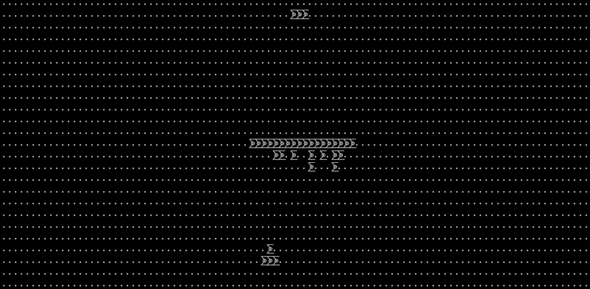
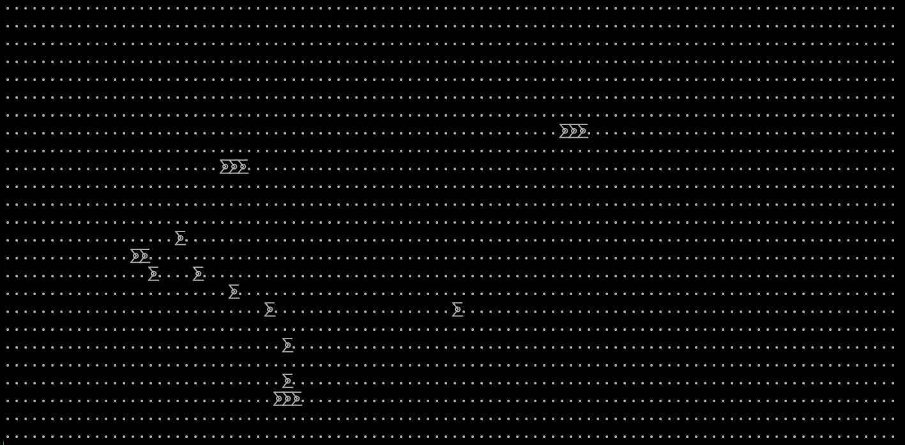

# Space Invaders in the terminal


## Getting Started
You'll first need to have the build tool `cargo` installed in your machine.

### Steps
* Git clone the repo
```console
git clone https://github.com/Eth3rna1/space-invaders.git
```
* Change directories into the project
```console
cd space-invaders
```
* Build the project
```console
cargo build --release
```

## About
The game is a basic recreation of the 1980's game, Space Invaders. I made it my own version with my own logic and scenes. The game is rendered in ASCII with two characters, a modulo two sum symbol (`⨊`) to indicate a pixel being on, and a period (`.`) to indicate the background, a pixel being off. The game is played with the arrow keys and you're able to shoot by pressing the spacebar.

|Game Key|Action|
|-|-|
|`p`| Pauses the game|
|`esc`| Quits the game|
|`(space bar)`| Shoots|
|`(right key)`| Moves right|
|`(left key)`| Moves left|

## Scenes
### Aliens
The starting wave is a group of aliens that come automatically start shooting as soon as your under them. They have the ability to spray bullets at you, so be wise if you decide to follow one.


### Speedster 1/3
I reimplemented the speedster, my speedster implementation gives the speedster three lives. In its first life, the speedster goes side to side whilst at the same time, spraying bullets at you.


### Speedster 2/3
In the second life of the speedster, it will continue moving side to side and shooting, but periodically, the speedster will move close to you, so you have to make sure you're positioning yourself correctly.


### Speedster 3/3
The last life of the speedster, you've unleashed its final form, the final speedster has the ability to move obstacles, so beware and be careful for it can be unpredictable.

#### Phase 1 *Snow Scene*

#### Phase 2 *Falling Blocks Scene*

#### Phase 3 *Zigzag Maniac Scene*

